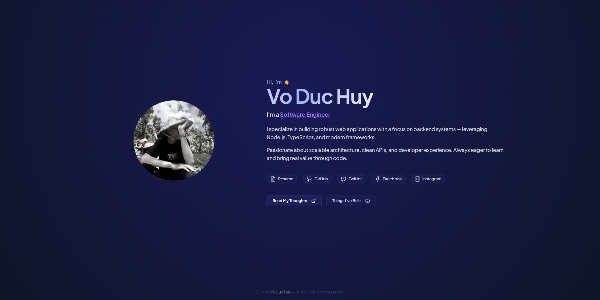

# Codient Platform

A modern, feature-rich blogging platform built with React and Node.js.

## Project Overview

Codient is a full-stack blogging platform that provides a seamless experience for both content creators and readers. The platform consists of two main components:

- **Client Application**: A modern React-based frontend
- **API Server**: A robust Node.js backend



## Features

- Clean and intuitive user interface
- Responsive design for all devices
- Dynamic content management
- Rich text editor for blog posts
- User authentication and authorization
- Dashboard for content management


## Blog Interface

The blog interface provides an excellent reading experience with clean typography and well-organized content structure.


## Technologies Used

### Frontend (codient-client)

- **React** - UI library
- **Vite** - Build tool and development server
- **JSX** - JavaScript syntax extension
- **Context API** - State management
- **React Router** - Navigation and routing
- **Vercel** - Deployment platform

### Backend (codient-api)

- **Node.js** - Runtime environment
- **TypeScript** - Programming language
- **Express** - Web framework
- **TypeORM** - Object-Relational Mapping
- **InversifyJS** - Dependency injection
- **JWT** - Authentication
- **Docker** - Containerization

### Additional Features

- **Google Analytics 4** - Traffic analytics
- **ImageKit** - Image optimization and delivery
- **OAuth2** - Third-party authentication

## Getting Started

1. Clone the repository
2. Install dependencies:

   ```bash
   # For client
   cd codient-client
   npm install

   # For API
   cd codient-api
   npm install
   ```

3. Set up your environment variables
4. Start the development servers:

   ```bash
   # Client
   npm run dev

   # API
   npm run dev
   ```

## License

This project is licensed under the MIT License - see the [LICENSE](LICENSE) file for details.

---

Made with ❤️ by [Vo Duc Huy](https://github.com/vdhuyme/)
